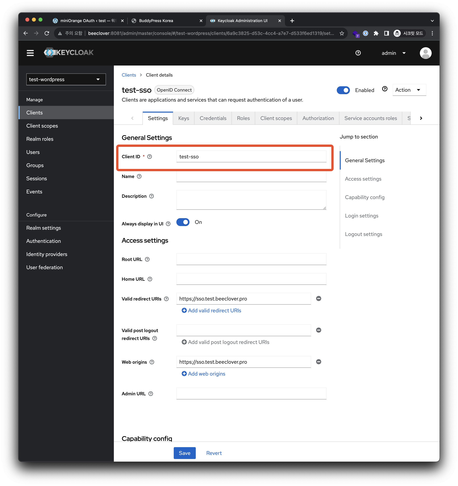

## REF

https://www.keycloak.org/getting-started/getting-started-docker
https://plugins.miniorange.com/ko/keycloak-single-sign-on-wordpress-sso-oauth-openid-connect

wordpress 가이드는 keycloak의 구버전을 사용한 예시라서 이해하기 어려웠다. 줌라의 가이드를 보고 비슷하게 따라하면된다.
https://www.youtube.com/watch?v=8FJRHbKwquc

## keycloak + wordpress 튜토리얼

### keycloak 구성하기

#### 새로운 Realm을 생성


Realm name에 test-wordpress 입력


#### 테스트용 Users 만들기


해당 유저로 들어가서 Credentials 생성하기

1. Users
2. 생성한 admin
3. Credentials 탭으로
4. 패스워드 생성
5. 패스워드 입력, Temporary 비활성화


#### 테스트용 Client 만들기


Client id와 Client secret 기억해두기, 복사해두기




### wordpress에서 SSO 활성화하기

wordpress plugins - `OAuth Single Sign On – SSO (OAuth Client)` 설치하기


3번에서 도메인을 아래처럼 설정한다.

Authorization Endpoint를 아래처럼

```diff
- {your-domain}/auth/realms/{realm}/protocol/openid-connect/auth
+ {your-domain}/realms/{realm}/protocol/openid-connect/auth
```

Token Endpoint를 아래처럼

```diff
- {your-domain}/realms/{realm}/protocol/openid-connect/token
+ {your-domain}/realms/{realm}/protocol/openid-connect/token
```

그리고 다음으로 넘어가면!


로그인완료!